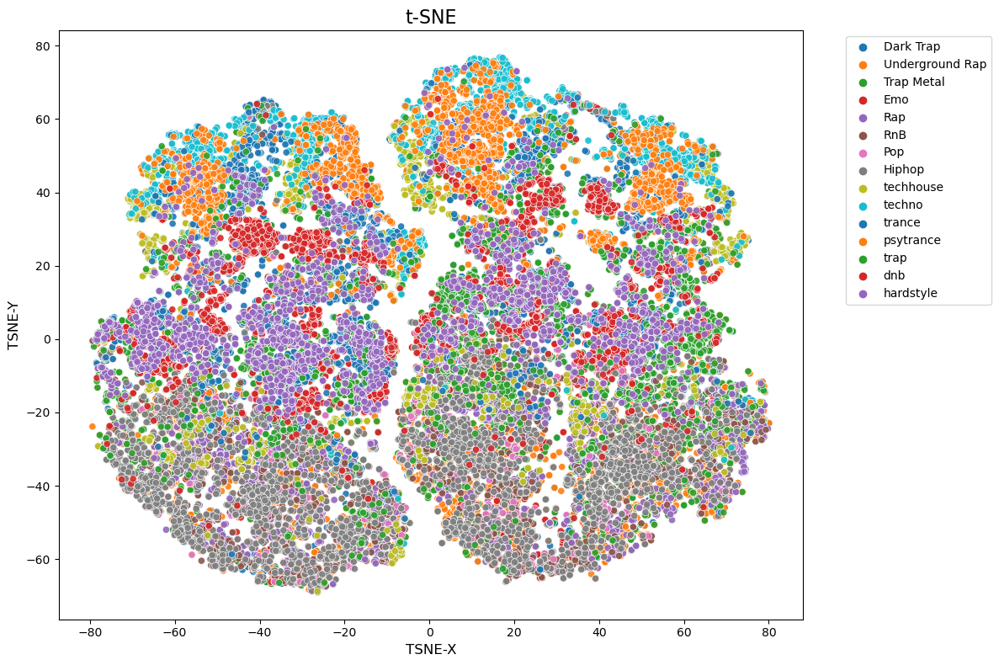
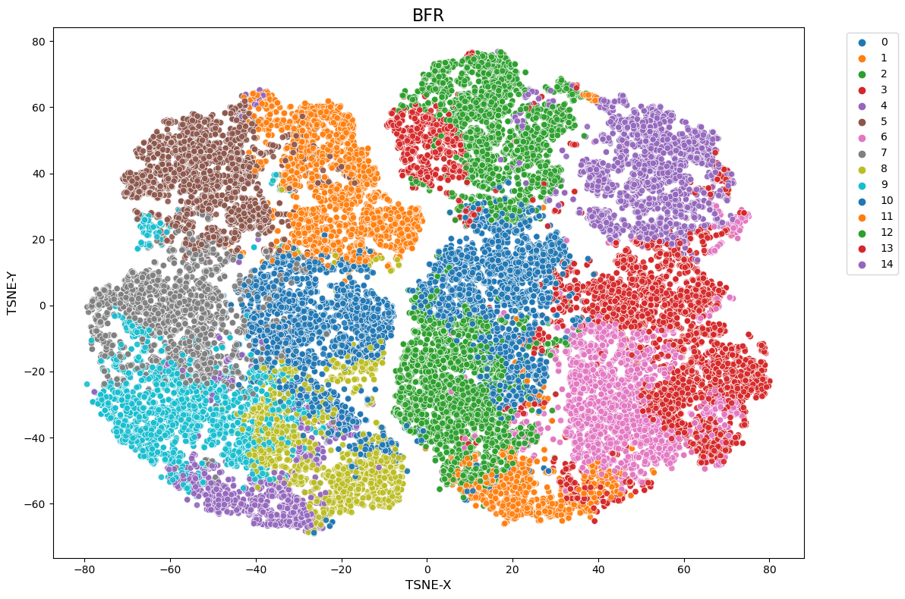

# Spotify-clustering
Spotify Song Genre Clustering
Overview
This project focuses on clustering Spotify song genres using the Bradley-Fayyad-Reina (BFR) clustering algorithm, implemented from scratch. The Spotify Songs dataset is used to explore genre patterns by grouping songs based on their features. To evaluate clustering performance, a cross-tabulation accuracy approach is applied, and the results are visualized with t-SNE (t-Distributed Stochastic Neighbor Embedding) for dimensionality reduction.

Features
Custom BFR Algorithm Implementation: Efficiently clusters high-dimensional data.
Spotify Songs Dataset: Includes detailed features such as tempo, loudness, and energy.
Performance Evaluation: Uses cross-tabulation for accuracy assessment.
Visualization: Leverages t-SNE for a 2D representation of clusters.
Technologies
Python
NumPy
Pandas
Matplotlib/Seaborn
Scikit-learn

## Here’s a t-SNE plot visualizing the clusters:  

  

## Here’s a BFR plot visualizing the clusters:  

  
